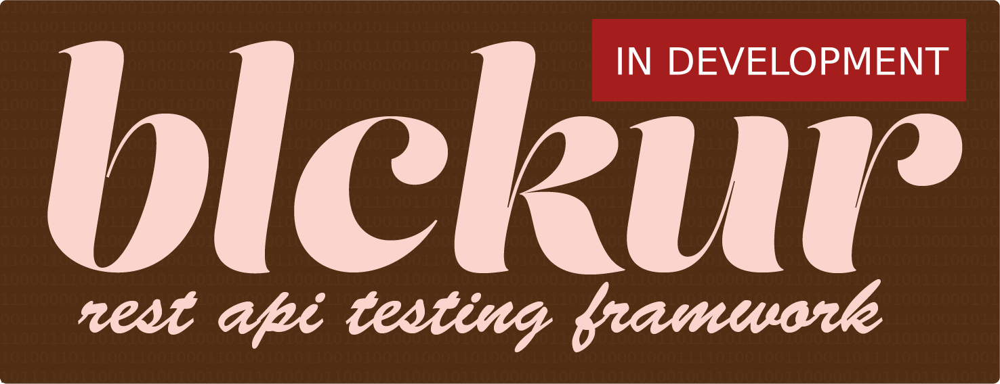

[](https://blckur.com)

# blckur: rest api testing framework
[Blckur](https://github.com/blckur/blckur) allows quickly writing unittests
for your REST API and microservices with a familiar format based on MongoDBs
query language. More information available at [blckur.com](https://blckur.com)

## test suites

Test suites are the base class for groups of test cases. The request options
and authentication is defined in the test suite.

| attributes | description |
| ---------- | ----------- |
| base_url | The base url of requests. The test case path will be appended to this url. |
| filter | Instance of ReportFilter used to filter output |
| formatter | Instance of ReportFormatter used to format output |
| handler | Instance of ReportHandler used to handle output |

## operators

### $has

Tests that the output array contains an object.

```python
@blckur.append_to(ExampleSuite)
class GetExample(blckur.TestCase):
    method = 'GET'
    path = '/example'
    expect_status = 200
    expect_json = {'$has': {
        'key': 'value0',
    }}

matching_output = [
    {'key': 'value0'},
    {'key': 'value1'},
]
```

### $hasnt

Tests that the output array doesn't contain an object.

```python
@blckur.append_to(ExampleSuite)
class GetExample(blckur.TestCase):
    method = 'GET'
    path = '/example'
    expect_status = 200
    expect_json = {'$hasnt': {
        'key': 'value0',
    }}

matching_output = [
    {'key': 'value1'},
    {'key': 'value2'},
]
```

### $in

Checks that the output value exists in the provided array.

```python
@blckur.append_to(ExampleSuite)
class GetExample(blckur.TestCase):
    method = 'GET'
    path = '/example'
    expect_status = 200
    expect_json = {
        'key': {'$in': ['value0', 'value1']},
    }

matching_output = {
    'key': 'value1',
}
```

### $nin

Checks that the output value doesn't exists in the provided array.

```python
@blckur.append_to(ExampleSuite)
class GetExample(blckur.TestCase):
    method = 'GET'
    path = '/example'
    expect_status = 200
    expect_json = {
        'key': {'$nin': ['value0', 'value1']},
    }

matching_output = {
    'key': 'value2',
}
```

### $all

Checks that the output value contains all the provided elements in the array.

```python
@blckur.append_to(ExampleSuite)
class GetExample(blckur.TestCase):
    method = 'GET'
    path = '/example'
    expect_status = 200
    expect_json = {
        'key': {'$all': ['value0', 'value1']},
    }

matching_output = {
    'key': ['value0', 'value1', 'value2'],
}
```

### $size

Checks that the output value size matches the provided size.

```python
@blckur.append_to(ExampleSuite)
class GetExample(blckur.TestCase):
    method = 'GET'
    path = '/example'
    expect_status = 200
    expect_json = {
        'key': {'$size': 2},
    }

matching_output = {
    'key': ['value0', 'value1'],
}
```

### $exists

Checks that the output contains or doesn't contain the provided key.

```python
@blckur.append_to(ExampleSuite)
class GetExample(blckur.TestCase):
    method = 'GET'
    path = '/example'
    expect_status = 200
    expect_json = {
        'key': {'$exists': True},
    }

matching_output = {
    'key': 'value',
}
```

### $ne

Checks that the output value is not equal to the provided value.

```python
@blckur.append_to(ExampleSuite)
class GetExample(blckur.TestCase):
    method = 'GET'
    path = '/example'
    expect_status = 200
    expect_json = {
        'key': {'$ne': 'value1'},
    }

matching_output = {
    'key': 'value0',
}
```

### $lt

Checks that the output value is less then the provided value.

```python
@blckur.append_to(ExampleSuite)
class GetExample(blckur.TestCase):
    method = 'GET'
    path = '/example'
    expect_status = 200
    expect_json = {
        'key': {'$lt': 100},
    }

matching_output = {
    'key': 10,
}
```

### $lte

Checks that the output value is less then or equal to the provided value.

```python
@blckur.append_to(ExampleSuite)
class GetExample(blckur.TestCase):
    method = 'GET'
    path = '/example'
    expect_status = 200
    expect_json = {
        'key': {'$lte': 100},
    }

matching_output = {
    'key': 100,
}
```

### $gt

Checks that the output value is greater then the provided value.

```python
@blckur.append_to(ExampleSuite)
class GetExample(blckur.TestCase):
    method = 'GET'
    path = '/example'
    expect_status = 200
    expect_json = {
        'key': {'$gt': 100},
    }

matching_output = {
    'key': 110,
}
```

### $gte

Checks that the output value is greater then or equal to the provided value.

```python
@blckur.append_to(ExampleSuite)
class GetExample(blckur.TestCase):
    method = 'GET'
    path = '/example'
    expect_status = 200
    expect_json = {
        'key': {'$gte': 100},
    }

matching_output = {
    'key': 100,
}
```

### $not

Checks that the provided expression is not true.

```python
@blckur.append_to(ExampleSuite)
class GetExample(blckur.TestCase):
    method = 'GET'
    path = '/example'
    expect_status = 200
    expect_json = {
        'key': {'$not': {'$gt': 100}},
    }

matching_output = {
    'key': 10,
}
```

### $and

Checks that all of the provided expression are true.

```python
@blckur.append_to(ExampleSuite)
class GetExample(blckur.TestCase):
    method = 'GET'
    path = '/example'
    expect_status = 200
    expect_json = {
        'key': {'$and': [
            {'key': {'$ne': 'value1'}},
            {'key': {'$exists': True}},
        ]},
    }

matching_output = {
    'key': 'value0',
}
```

### $and

Checks that all of the provided expression are true.

```python
@blckur.append_to(ExampleSuite)
class GetExample(blckur.TestCase):
    method = 'GET'
    path = '/example'
    expect_status = 200
    expect_json = {
        'key': {'$and': [
            {'key': {'$ne': 'value1'}},
            {'key': {'$exists': True}},
        ]},
    }

matching_output = {
    'key': 'value0',
}
```

### $or

Checks that one of the provided expression are true.

```python
@blckur.append_to(ExampleSuite)
class GetExample(blckur.TestCase):
    method = 'GET'
    path = '/example'
    expect_status = 200
    expect_json = {
        'key': {'$or': [
            {'key': 10},
            {'key': {'$gt': 100}},
        ]},
    }

matching_output = {
    'key': 10,
}
```

### $nor

Checks that none of the provided expression are true.

```python
@blckur.append_to(ExampleSuite)
class GetExample(blckur.TestCase):
    method = 'GET'
    path = '/example'
    expect_status = 200
    expect_json = {
        'key': {'$nor': [
            {'key': 10},
            {'key': {'$gt': 100}},
        ]},
    }

matching_output = {
    'key': 5,
}
```

### $text

Checks that the provided string exists in the output value.

```python
@blckur.append_to(ExampleSuite)
class GetExample(blckur.TestCase):
    method = 'GET'
    path = '/example'
    expect_status = 200
    expect_json = {
        'key': {'$text': 'test'},
    }

matching_output = {
    'key': "example_test_string',
}
```

### $where

Checks that the provided function returns true given the output value.

```python
def test_value(value):
    if value == 10:
        return True

@blckur.append_to(ExampleSuite)
class GetExample(blckur.TestCase):
    method = 'GET'
    path = '/example'
    expect_status = 200
    expect_json = {
        'key': {'$where': test_value},
    }

matching_output = {
    'key': 10,
}
```

### $regex

Checks that the provided regular expression is true given the output value.

```python
@blckur.append_to(ExampleSuite)
class GetExample(blckur.TestCase):
    method = 'GET'
    path = '/example'
    expect_status = 200
    expect_json = {
        'key': {'$regex': '^[a-z0-9]+$'},
    }

matching_output = {
    'key': 'abc123',
}
```

### $type

Checks that the output value is of the provided type `'number'`, `'string'`,
`'boolean'`, `'array'`, `'object'` or `'null'`.

```python
@blckur.append_to(ExampleSuite)
class GetExample(blckur.TestCase):
    method = 'GET'
    path = '/example'
    expect_status = 200
    expect_json = {
        'key': {'$type': 'number'},
    }

matching_output = {
    'key': 100,
}
```
